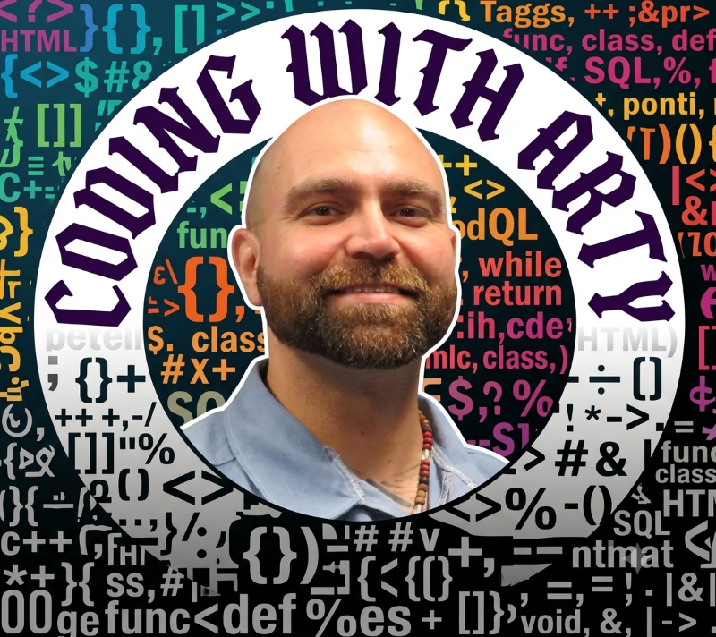
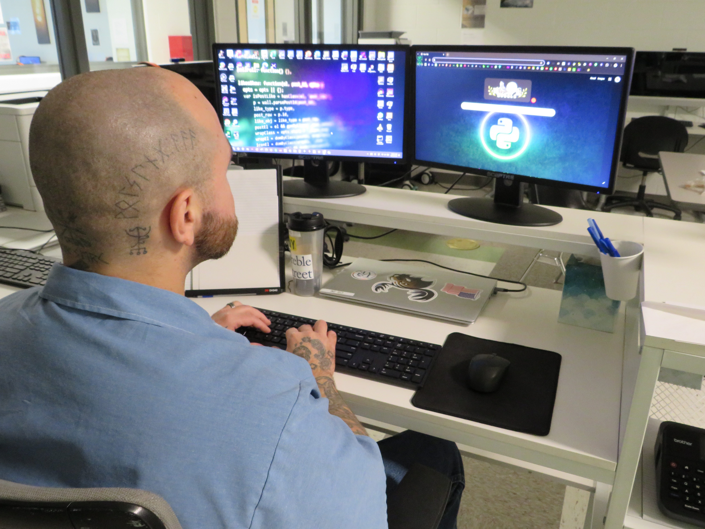

# 
👋 coding-with-arty

  

## 🎛️ Music Technology Student | Developer | Educator | Musician

Hi, I'm **Arty**.

My journey into technology and music hasn't been a straight path, but that's what makes it meaningful.

I returned to college determined to build a better future through education, creativity, and hard work. Along the way, I discovered that my passion lives at the intersection of **music and technology**. While I enjoy web development and software engineering, my long-term goal is to create audio plugins, virtual instruments, and other tools that help musicians bring their ideas to life.

Today, I'm a **Music Technology student at the University of Maine at Augusta (UMA)**, where I'm combining my love for music with software development, digital media, and audio technology. Every class, project, and late-night study session is another step toward turning that vision into reality.

Outside of school, I spend my time building websites, teaching programming, mentoring others, playing guitar, and learning everything I can about the technology that powers modern music production.

---

## 🎸 What Drives Me

Music has always been more than entertainment to me—it's connection, expression, and community.

Technology has given me the opportunity to learn new skills, solve problems, and help others grow. Bringing those two worlds together is what excites me most.

I believe in:

* Learning through building.
* Sharing knowledge with others.
* Continuous growth and self-improvement.
* Creating tools that empower creativity.
* Using education as a way to create new opportunities.

---

## 🚀 What I'm Working On

* Leading web development projects for community organizations.
* Teaching Python and web development to adult learners.
* Studying Music Technology and audio production.
* Learning the foundations of DSP (Digital Signal Processing).
* Exploring audio software and plugin development.
* Building projects that combine creativity and technology.

---

## 🛠 Skills & Technologies

### Development

* Python
* JavaScript
* HTML5
* CSS3
* Bash

### Frameworks & Tools

* Flask
* Django
* Streamlit
* Bootstrap
* Jinja
* Vite
* Git & GitHub
* Visual Studio Code
* Node.js

### Music & Audio

* Audio Production
* Recording & Mixing
* Music Technology
* Digital Media
* Guitar Performance

---

## 📚 Why This GitHub Exists

This GitHub is a record of my growth.

You'll find school projects, teaching materials, web development work, experiments, and the occasional idea that started with a simple question: *"What happens if I try this?"*

Some repositories are polished. Some are learning exercises. All of them represent progress.

My goal isn't just to write better code—it's to keep learning, keep creating, and eventually contribute tools that help musicians, educators, and creators do what they love.

---

### 
🎵 Where Code Meets Creativity, and Music Becomes Possibility.

---

  

